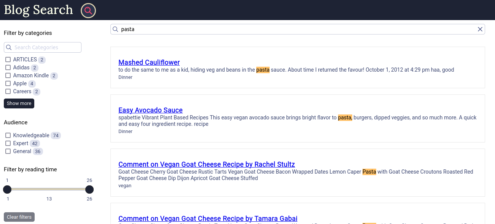

### Demo for Blog Search

A search for blogs built using Typesense engine as backend and Typesense-Instantsearch-adapter for UI.

---

Each document for the search engine collection should follow the below Schema:

```
{
  { name: 'title', type: 'string' },
  { name: 'category', type: 'string' },
  { name: 'url', type: 'string' },
  { name: 'description', type: 'string' },
  { name: 'text', type: 'string' },
  { name: 'read_time', type: 'int32' },
  { name: 'aud', type: 'string' }
}
```

- `Download typesense-server for your platform from https://typesense.org/downloads/`
- `Create a data directory something like /tmp/typesense-data Make sure it is not deleted on reboot`
- `mkdir /tmp/typsense-data2`
- `Enter into a python venv`
- `cd blogSearch && npm i && bash libInstall.sh`

- `nohup typesense-server --data-dir=/tmp/typesense-data --api-key=xyz --listen-port 8108 --enable-cors &`

- `node deleteSchema.js blogs && node deleteSchema.js structuredResults`
- `node createSchemaBlogs.js && node createSchemaStructuredResults.js`
- cd substacksearchengine
- python manager runserver
- `python manage.py importAllSiteMaps <appropriate option>`
- `python manage.py importAllNewsletterPosts`
- `python manage.py postToTypeSense`

---
  Frontend

- `rm dist # If dist/ is already present`
- `parcel build index.html`
- `mv dist/ /var/www/blogSearch/`

---

Additionally, the number of documents in a collection can be viewed using:

`node checkDocuments.js`

A collection can be deleted using:

`node deleteSchema.js <collection name>`

---

Nginx setup:

- `cp blogSearchNginx.conf /etc/nginx/conf.d/blogSearchNginx.conf`
- `sudo systemctl stop nginx`
- `sudo systemctl start nginx`
- `systemctl status nginx.service`
- `setsebool -P httpd_can_network_connect 1`

---

The UI will be running on interviewblindspots.com/index.html

**Homescreen** 

---

**Search Screen** 

---

> Happy Searching

